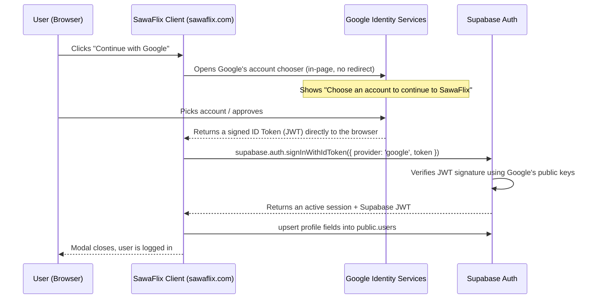

# Understanding Google Sign-In on SawaFlix — A Beginner's Guide

This document explains, from first principles, how Google sign-in now works on SawaFlix. It assumes you know nothing about OAuth. By the end you should be able to explain the flow to someone else, and know exactly which file to open when something breaks.

---

## Part 1 — The Concepts You Need First

### 1.1 What problem is "Sign in with Google" solving?

You don't want to build your own username/password system, store passwords securely, handle "forgot password" emails, etc. Instead, you let Google vouch for the user: "I (Google) have verified this person owns this email address — here's proof." Your app trusts that proof and creates a session.

That "proof" is the whole game. Everything below is about **how the proof is created, carried, and checked.**

### 1.2 Three actors in every OAuth flow

- **The User** — sitting in a browser, wants to log in.
- **The Client** — your app (SawaFlix, running in the browser or on your server).
- **The Identity Provider (IdP)** — Google, who actually knows the user's identity.

There's also, in our case, a fourth actor:

- **Supabase** — a "backend as a service" that stores your database (Postgres) and also runs an **auth engine**. Supabase itself doesn't know who the user is either — it also just trusts Google's proof, then creates a row for that user and issues *its own* session token (a Supabase JWT) so your app can talk to your database as that user.

### 1.3 Two kinds of tokens people confuse constantly

| Token | What it proves | Who reads it |
|---|---|---|
| **Access Token** | "I'm allowed to call Google APIs on this user's behalf" (e.g. read their calendar) | Google's APIs |
| **ID Token** | "This user's identity is verified — here's their email/name/photo" | **Your app / Supabase** |

This distinction is the single most important thing in this document. An **Access Token is a key that opens doors at Google**. An **ID Token is a signed identity card** — it's a JWT (see below) that says "Google verifies this person is jane@gmail.com," and anyone who trusts Google's signature can read it.

**Supabase's `signInWithIdToken()` needs an ID Token, not an Access Token.** This mismatch was an actual bug in the first draft of our implementation — more on that in Part 4.

### 1.4 What is a JWT?

JWT = JSON Web Token. It's a string with three parts separated by dots: `header.payload.signature`. The payload is just JSON (e.g. `{ "email": "jane@gmail.com", "aud": "your-client-id", ... }`), and the signature is cryptographically produced by the issuer (Google) using a private key **only Google has**.

Anyone can *read* a JWT's payload (it's just base64, not encrypted) — but nobody can *forge* one without Google's private key. To verify a JWT, you fetch Google's *public* keys (published at a well-known URL, this set of keys is called a **JWKS** — JSON Web Key Set) and check the signature mathematically matches. This is exactly what Supabase does when you call `signInWithIdToken()` — no network call to Google is even needed for the secret part, because signature verification uses only Google's already-public keys.

This is why **no Client Secret is involved** in our new flow — a secret is a private credential used to *authenticate your server* to Google (e.g. "prove this request really comes from SawaFlix's backend"). Verifying a signed JWT doesn't require that; it only requires Google's already-public verification keys.

### 1.5 Client ID vs Client Secret

- **Client ID**: public, safe to ship in your frontend JavaScript. It identifies *which app* is asking. Think of it like a storefront's public business name.
- **Client Secret**: private, must never appear in frontend code. It proves *your server* is really that app, used only in server-to-server exchanges.

Our new flow only ever uses the Client ID, on the client (browser). That's intentional, and covered in Part 4.

---

## Part 2 — Why Google Was Showing "supabase.co" (The Old Flow)

### 2.1 The old flow: Server-Redirect OAuth

Before this change, clicking "Continue with Google" called `supabase.auth.signInWithOAuth({ provider: 'google' })`. Here's what actually happened, step by step:

1. Your browser is redirected **away from sawaflix.com** to Supabase's own auth endpoint (`xjxbjnjspmmpfngbdihd.supabase.co/auth/v1/authorize`).
2. Supabase redirects you again, this time to Google's login screen.
3. Google needs to tell you *who is asking for your identity*. But from Google's perspective, **the entity that just redirected the user to Google was `supabase.co`** — because that's the domain in the OAuth `redirect_uri` Google was told to send the user back to. Google has no idea "SawaFlix" exists in this chain; all it sees is a request that will return to a Supabase URL.
4. Hence the screen said: *"You're signing back in to xjxbjnjspmmpfngbdihd.supabase.co."*
5. After you approve, Google redirects back to Supabase with a temporary `code`.
6. Supabase exchanges that `code` for tokens (this exchange step is where a **Client Secret** is required — Supabase's backend holds it, not your frontend).
7. Supabase redirects your browser back to `sawaflix.com/auth/callback` with a session.

### 2.2 Why not just "rebrand" it?

Because the branding shown is a property of **whichever domain is directly in the OAuth redirect chain with Google**, not something you can theme from your own app. To make Google show `sawaflix.com` in that exact server-redirect flow, Supabase would need to run the *callback* on a domain you control — which is Supabase's paid "Custom Domain" feature (Pro plan + add-on).

### 2.3 The insight that avoids the paywall

If **your own frontend, running on sawaflix.com, talks to Google directly** (no redirect through Supabase's domain at all), then the domain Google shows the user is simply whatever domain the browser is currently on: `sawaflix.com`. Supabase only enters the picture *after* Google has already handed back proof of identity — Supabase's job shrinks to "verify this proof and create a session," which needs no redirect and no custom domain.

That's the entire idea behind the new flow.

---

## Part 3 — The New Flow, Step by Step

This is called **Google Identity Services (GIS) + `signInWithIdToken`**.



Narrated:

1. **User clicks the button.** Nothing leaves the page yet.
2. **Google's own script (loaded from Google, running on your page) opens the account chooser.** Because this UI is rendered *by Google's script embedded in your page*, and no page redirect happened, Google displays the domain of the page that embedded it: `sawaflix.com`. This is the fix.
3. **User approves.** Google's script receives a **signed JWT (the ID Token)** — proof of identity — and hands it to your page's JavaScript via a callback function, entirely client-side.
4. **Your code hands that JWT to Supabase**: `supabase.auth.signInWithIdToken({ provider: 'google', token: credential })`.
5. **Supabase verifies the JWT's signature** against Google's public keys (no secret involved — see §1.4), checks it was issued for *your* Client ID (the `aud` claim), and if valid, creates (or finds) a matching row in Supabase's internal `auth.users` table and returns a session.
6. **Your app enriches the profile** — see Part 5 — because the JWT only carries basic fields (email, name, picture), and our `public.users` table wants a couple of app-specific fields set (like marking the account as "approved").

---

## Part 4 — The Bug We Avoided (Access Token vs ID Token, Revisited)

The library `@react-oauth/google` offers two very different tools, and mixing them up is the most common mistake in this kind of integration:

- **`useGoogleLogin()`** — implements Google's classic OAuth2 "token client." Even with `flow: 'implicit'`, this returns an **Access Token**, meant for calling Google APIs. It does **not** return an ID Token. If you pass this to `signInWithIdToken`, it silently fails (the field is `undefined`).
- **`<GoogleLogin />`** — implements "Sign In With Google" (GIS), Google's newer identity-focused widget. Its `onSuccess` callback receives a `credential` field, which **is** the signed ID Token (JWT) we need.

Our implementation uses `<GoogleLogin />`, never `useGoogleLogin()`, specifically because we need the ID Token, not API access.

### 4.1 Why does the button still look like your custom design?

Google's real `<GoogleLogin />` button renders Google's own UI (an iframe, styled by `theme`/`shape` props) — you cannot restyle it arbitrarily, and browsers/Google restrict scripting into that iframe for security (you can't just `.click()` it from your own code). But product design wanted the existing red-accented "Continue with Google" pill button.

The trick used (a standard, widely-used pattern): render the **real** Google button, but make it invisible (`opacity: 0`) and stack it exactly on top of your **visible, styled** button using CSS (`position: absolute; inset: 0`). The user sees your styled button and clicks it — but because the invisible real button is on top in the stacking order, **the click actually lands on Google's button**, which does the real work. Your styled button underneath is purely decorative.

---

## Part 5 — What Happens in Your Database

### 5.1 The `on_auth_user_created` trigger

Supabase's internal `auth.users` table is separate from your app's `public.users` table (which has all the SawaFlix-specific columns: `avatar_url`, `role`, `verification_status`, etc). Your database already had a Postgres trigger, `on_auth_user_created`, that fires automatically whenever a **new row is inserted into `auth.users`** (i.e., whenever anyone signs up, by any method) and runs a function called `handle_new_user()`.

That function copies over the basics: `id`, `email`, a guessed `username`, and role. This happens **regardless of which sign-in flow was used** — it's triggered by the database itself, not by our frontend code, so it works for both the old and new flow equally.

However, `handle_new_user()` does **not** set:
- The user's Google profile photo (`profile_image_url`)
- `verification_status = 'approved'` (it defaults new users to `'pending'`)

### 5.2 Why we added a client-side "upsert" step

In the **old flow**, the enrichment above was done by your Next.js server, inside `app/(auth)/auth/callback/route.js`, using the **Service Role Key** (a privileged key that bypasses Row Level Security) right after exchanging the code.

In the **new flow**, there is no server callback anymore — everything happens in the browser. So immediately after `signInWithIdToken()` succeeds, `AuthModal.tsx` now runs:

```ts
await supabase.from('users').upsert({
  id: data.user.id,
  email: data.user.email,
  username: meta.full_name || meta.name || ...,
  profile_image_url: meta.avatar_url || meta.picture || null,
  verification_status: 'approved',
  updated_at: new Date().toISOString(),
}, { onConflict: 'id' });
```

This runs as the **logged-in user themselves** (using the public "anon" key, now authenticated), not as an admin. That's only allowed because of a Row Level Security (RLS) policy already present on `public.users`:

```sql
create policy "Users can update own profile"
on public.users for update
using (auth.uid() = id)
with check (auth.uid() = id);
```

Translated: "A logged-in user may update the row in `public.users` whose `id` matches their own auth ID — and no one else's." This is a safe, minimal permission — a user can only ever touch their own profile row.

### 5.3 What is Row Level Security (RLS), briefly?

By default, if RLS is enabled on a Postgres table (as it is on every table in this project), **nobody can read or write to it at all** — not even a logged-in user — until a policy explicitly grants permission. This is why the app doesn't just let any authenticated request modify any user's row; every table's access rules are defined explicitly, per operation (`SELECT`/`INSERT`/`UPDATE`/`DELETE`), as SQL policies. It's Postgres-level security, so even if a bug in the frontend tried to update someone else's row, the *database itself* would refuse it.

---

## Part 6 — The Google Cloud Console Side

Two Google Cloud Console screens matter here, and they're separate from your code entirely:

### 6.1 OAuth Consent Screen
This controls the **branding** shown on the account chooser: App name, logo, support email, and the "Authorized domain" (`sawaflix.com`). This is exactly the screen that controls whether it says "Continue to SawaFlix" vs "Continue to Sawa" vs the old `supabase.co` — it's a Google-side setting, not something fixable in code.

### 6.2 Credentials → OAuth Client ID
This defines:
- **Authorized JavaScript origins** — the exact domains allowed to *initiate* a GIS request (e.g. `http://localhost:3000`, `https://sawaflix.com`). If your page's origin isn't listed here, Google refuses the request.
- The **Client ID** itself, which is what you copy into `NEXT_PUBLIC_GOOGLE_CLIENT_ID`.

Note the `NEXT_PUBLIC_` prefix — in Next.js, any environment variable prefixed this way is intentionally bundled into the **browser-visible** JavaScript. That's correct and expected here, since (per Part 1.5) the Client ID is meant to be public.

---

## Part 7 — Code Map (Where Everything Lives)

| File | Role |
|---|---|
| `components/providers/GoogleAuthProvider.tsx` | A small client-side wrapper around `<GoogleOAuthProvider>` (from `@react-oauth/google`). It loads Google's identity script and makes the Client ID available to every `<GoogleLogin />` in the app. |
| `app/layout.tsx` | Wraps the entire app in `<GoogleAuthProvider>` so the Google script is available on every page. |
| `components/Dashboard/AuthModal.tsx` | The sign-in modal. Contains the styled button + the invisible real `<GoogleLogin />` overlay, the `handleGoogleCredential` function that calls `signInWithIdToken`, and the profile-enrichment upsert. |
| `app/(auth)/auth/callback/route.js` | The **old** server-redirect callback. No longer used by Google sign-in, but left in place (harmless, unused for this flow) in case it's needed elsewhere or as a fallback. |
| `.env.local` → `NEXT_PUBLIC_GOOGLE_CLIENT_ID` | The public Client ID, copied from Google Cloud Console → Credentials. |

---

## Part 8 — Glossary

- **OAuth 2.0**: An industry-standard protocol for delegated authorization (letting an app act on a user's behalf) — access tokens live here.
- **OIDC (OpenID Connect)**: A layer built on top of OAuth 2.0 specifically for *authentication* (proving identity) — ID tokens live here. "Sign in with Google" is really OIDC, not plain OAuth.
- **JWT**: A signed, self-contained token format used to carry claims (like identity) that can be verified without contacting the issuer every time.
- **JWKS**: The public key set an issuer (Google) publishes, used to verify JWT signatures.
- **RLS (Row Level Security)**: Postgres feature that restricts which rows a query can see/modify, enforced by the database itself.
- **Client ID**: Public identifier for your app, registered with Google.
- **Client Secret**: Private credential, used only for server-to-server exchanges — not used in this flow.
- **Access Token**: Proves permission to call an API on a user's behalf.
- **ID Token**: Proves identity — this is what our flow actually needs.

---

## Part 9 — How to Test / Debug This Yourself

1. Open the app, trigger the sign-in modal, open browser DevTools → Network tab.
2. Click "Continue with Google" — you should see Google's account chooser appear **without the page navigating away** (URL bar stays on `sawaflix.com`).
3. After approving, check DevTools → Application → Cookies/Local Storage for a Supabase session, or just watch the modal close and the app reflect a logged-in state.
4. If it fails silently, check the browser console for errors from `handleGoogleCredential` (logged as `"Google Sign-In Error:"`).
5. In Supabase, check `public.users` for your row — `profile_image_url` and `verification_status` should be populated after a successful login.
6. If the consent screen shows the wrong app name, that's a Google Cloud Console → OAuth Consent Screen setting, not a code bug (see Part 6.1).
