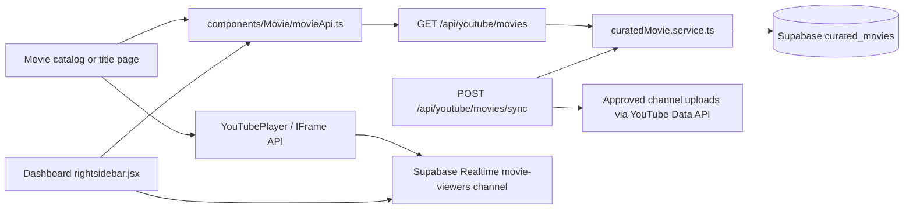

# SawaFlix Movies: Design and Technical Handoff

## Purpose

This document describes the movie catalog and title/watch experience in the SawaFlix dashboard, its current frontend/backend contracts, responsive behavior, and the recommended next phase for admin- and creator-managed movie publishing.

It is intended for engineers working across `sawaflix-app`, `sawaflix-backend`, and `sawaflix-admin-app`.

## Design Reference

The intended visual reference is the SawaFlix movie page screenshot attached to the engineering request: dashboard shell with left navigation and right recommendations, a cinematic movie cover, category filters, a featured title, and horizontal recommendations. The source attachment is not available as a file in this repository. The unrelated `public/movie.jpg` is an Oppenheimer poster and must not be used as the SawaFlix reference.

To make the reference portable in Git, save the supplied screenshot as `docs/assets/movie-page-reference.png` and add this Markdown image directly below:

```md

```

Do not substitute a movie poster or a fabricated recreation for the supplied UI screenshot.

## Product Surface

### Movie catalog

Route: `/dashboard/movie`

The catalog is rendered inside the shared dashboard shell. The shell owns the top navigation, left sidebar, right sidebar, page scroll container, theme tokens, and persistent audio player. The page content should not add another fixed viewport layer.

The catalog has four main regions:

1. **Genre filter row**: horizontally scrollable filters above the featured area. The selected filter uses foreground/background theme tokens.
2. **Featured title banner**: a static, full-cover movie image with contrast overlays, metadata, title, description, watchlist action, watch action, and previous/next carousel controls. The page rotates featured items on a timer, pauses while hovered, and also accepts swipe/arrow navigation.
3. **Recommended rail**: horizontally scrolling movie cards, independent from the main genre-filtered grid.
4. **Movie grid and detail affordances**: responsive poster grid, desktop information sidebar, and mobile detail sheet.

Main implementation:

- `app/(dashboard)/dashboard/movie/page.tsx`
- `components/Movie/MovieHeroBanner.tsx`
- `components/Movie/MovieCard.tsx`
- `components/Movie/RightSidebarContent.tsx`
- `components/Movie/MovieDetailSheet.tsx`

### Movie title and watch page

Route: `/dashboard/movie/[id]`

The title view uses the shared dashboard frame and contains a cinematic title cover, real catalog title and synopsis, factual metadata, title details, episode guide when applicable, and related movies. The Watch Now action switches to the watch presentation without replacing the dashboard shell.

The watch presentation consists of:

- A centered 16:9 YouTube player using the app's `YouTubePlayer` IFrame API integration.
- SawaFlix logo, title, and return/close action over the player.
- Theme-aware title metadata and progress below the player.
- Expandable real catalog description.
- A horizontal, touch-scrollable episode card rail, current/next states, and continue-automatically control.
- A related-movie card rail after episodes.

Main implementation:

- `app/(dashboard)/dashboard/movie/[id]/page.tsx`
- `components/YoutubePlayer.tsx`
- `components/Movie/MovieEpisodeGuide.tsx`

The custom UI must control the real YouTube player object. A visual play state, simulated duration, static percentage, or fake seek bar is not a substitute for IFrame API commands/events.

## Dashboard Composition

`components/Dashboard/DashboardWrapper.jsx` owns the application chrome:

- `Header` is fixed at the top; content begins below it.
- `LeftSidebar` is fixed on desktop and becomes an overlay on mobile.
- `RightSidebar` is fixed on wide desktop layouts.
- The center `<main>` is the scrollable content surface with desktop margins for both sidebars.
- Movie content uses normal document flow inside that scroll surface.

When modifying movie pages, avoid `position: fixed` full-screen overlays unless the feature explicitly requires modal takeover. Such overlays obscure the header and sidebars and create competing scroll regions. Use the shell's available center-column width and allow the sidebars to remain independently scrollable.

## Responsive Behavior

Use CSS breakpoints already present in the application rather than JavaScript device detection.

- **Phone**: dashboard shell controls the navigation drawer; title content is single-column; movie recommendations and episodes use `overflow-x-auto`, `snap-x`, and touch-sized controls; avoid placing important information behind hover-only affordances.
- **Tablet**: preserve the single content column when the right sidebar is hidden; let card rails use the full available center width.
- **Desktop**: retain left and right dashboard chrome; constrain the movie/player content to the center column; align the title metadata and recommendation rails to the player width.
- **Wide desktop**: use available center width without stretching a 16:9 video into a panoramic strip. The player frame's aspect ratio remains stable.

Text and controls must remain legible in both theme modes. Themeable surfaces use CSS variables such as `--background`, `--surface`, `--foreground`, `--muted-foreground`, `--border`, and `--primary`. Reserve black/white fixed treatments for the actual video image/player overlays.

## Data and Request Flow



The current frontend mapping lives in `components/Movie/movieApi.ts`. It maps the backend DTO into `Movie` values: YouTube video ID, title, actual description, thumbnail, published year, duration, genres, language, series identity, and episode metadata. Empty backend descriptions remain empty; the UI must not invent a synopsis.

The current backend catalog is `public.curated_movies`, created by `sawaflix-backend/supabase/migrations/202609220001_create_curated_movies.sql`. The backend's `curatedMovie.service.ts` synchronizes qualifying long-form public, embeddable videos from the approved YouTube channel registry. `GET /api/youtube/movies` lists approved rows; `POST /api/youtube/movies/sync` is protected by `CRON_SECRET`. The table grants public read access to approved rows and revokes direct writes from `anon` and `authenticated` roles. It is a synchronized catalog, not an admin/creator authoring database.

## Live Viewer Avatars

The right sidebar's “Suggested movies” section can show overlapping profile avatars and names for users currently watching each suggested title. This UI uses Supabase Realtime Presence on a movie-specific topic:

- Topic: `movie-viewers:<youtube-video-id>`.
- A signed-in client tracks its user ID, display name, and profile image only while playback is active.
- The sidebar subscribes to the topics for suggested titles and de-duplicates presence by user ID.
- The active watch screen also renders the same live stack for the title currently playing.
- Each title only renders the avatar stack when at least one live viewer is present.
- The “and N others” value is derived from the unique live Presence entries; it is not a seeded/demo count.
- On pause, close, navigation, or component unmount, the track subscription is removed.
- Guests do not publish a fabricated identity. If anonymous presence is later enabled, it should be counted separately and never shown with an invented name/avatar.

Implementation: `components/Movie/MovieViewerPresence.tsx`, mounted as a tracker from the active player and as a display subscriber under movie suggestions in `components/Dashboard/rightsidebar.jsx`.

Before production rollout, verify Supabase Realtime channel limits, auth/session propagation, and channel authorization in the target Supabase project. Presence counts represent active connected player sessions/users, not cumulative views or all-time audience totals. If a large aggregate such as “43K others” is desired, it must come from a separately defined, measured, privacy-safe analytics metric and be labeled with its time window.

Presence topics contain real profile identity data and must be configured as private/authenticated Realtime channels with matching `realtime.messages` RLS policies before production. The current frontend uses the user's authenticated Supabase session for tracking and must not be treated as authorization by itself. Validate topic access with two authenticated accounts and an anonymous client in staging; anonymous clients should be denied access to identity-bearing Presence topics.

## Theme and Accessibility

- Use theme tokens for page surfaces, metadata, dividers, active states, and text.
- Do not use brand red as the only selected state; foreground/background contrast should communicate selection in both themes.
- Poster images need descriptive movie-title alt text when meaningful; decorative thumbnails use empty alt text.
- Icon-only actions need `aria-label`, visible focus styles, and target sizes suited for touch.
- The episode rail supports horizontal touch scrolling and buttons for pointer/keyboard navigation.
- Keep player title and controls above the video using a legible gradient, but do not intercept player controls (`pointer-events-none` on the overlay with pointer-enabled controls only).
- Viewer avatars expose accessible text naming the people represented; decorative image alt text remains empty when the accessible label is provided by the parent.

## Current Limitations

- Movie entries currently come from approved YouTube channels and are displayed as curated movies; creators/admins cannot author all movie fields through a dedicated movie publishing workflow.
- The legacy `public.movie`, `public.movies`, `public.seasons`, and `public.episodes` tables in `sawaflix-backend/schema.sql` are not the same data contract as `public.curated_movies`. Avoid silently mixing IDs or writing to these tables from the current curated catalog without a migration plan.
- The screenshot attachment must be checked into `docs/assets/movie-page-reference.png` to render inline in this document; it was not available as a local file at documentation time.
- Completed-view totals are not currently backed by a movie analytics endpoint, so the watch screen does not claim a completed-view count. Realtime watcher presence is live-session data and must not be conflated with completion/view totals.

## Next Phase: Admin and Creator Movie Publishing

### Recommended separation

Keep `curated_movies` as the read-only, YouTube-synchronized source. Add a managed title catalog for admin/creator-authored titles and return a normalized API response to the frontend. A title can use a YouTube video, Cloudflare Stream asset, or another approved storage provider without changing the movie UI model.

### Proposed entities

| Entity | Responsibility | Important fields |
|---|---|---|
| `managed_titles` | Movie or series metadata and publication/moderation state | `id`, `owner_user_id`, `title`, `description`, `content_type`, `poster_path`, `hero_path`, `status`, `published_at`, timestamps |
| `managed_media_assets` | Playback source and processing state | `id`, `title_id`, `episode_id`, `provider`, `provider_asset_id`, `playback_url`, `duration_seconds`, `processing_status`, `created_by` |
| `managed_seasons` | Ordered seasons for a series | `id`, `title_id`, `season_number`, `title`, unique `(title_id, season_number)` |
| `managed_episodes` | Episode metadata and ordering | `id`, `season_id`, `episode_number`, `title`, `description`, `poster_path`, timestamps, unique `(season_id, episode_number)` |
| `managed_title_genres` | Normalized genre relationship where editorial genre management is needed | `title_id`, `genre_id` |
| `managed_title_reviews` | Moderation decisions and audit trail | `title_id`, `reviewer_id`, `decision`, `notes`, `created_at` |

The above names are a proposal, not existing tables. The existing legacy `movies`/`seasons`/`episodes` schema must be assessed for data, references, ownership, and RLS before deciding whether to extend it or create versioned managed tables. Do not run a migration that duplicates a live production catalog without confirming its actual database state.

### Required states and permissions

Suggested title workflow: `draft -> submitted -> processing -> pending_review -> published`, with `rejected` and `archived` terminal/administrative paths. Video processing should be tracked independently from editorial approval; a title must not become publicly playable before the provider reports a ready asset and moderation approves it.

- Creators may create and update drafts they own, upload media to their authorized storage namespace, and submit their own title for review.
- Creators may not mark content as published, alter another creator's title, or change review/audit rows.
- Admins may review submissions, change moderation state, feature titles, and archive or restore content.
- Public/anonymous reads return published titles and ready assets only.
- Use server-side authorization for mutations. Do not rely only on hidden dashboard controls or client-supplied `creator_id`.
- Store storage object keys/provider asset IDs rather than expiring signed URLs as canonical database values. Generate signed playback/upload URLs at the API boundary where required.

### API shape to implement

- `POST /api/admin/movies` — create an admin-owned draft or validate an admin upload.
- `POST /api/creator/movies` — create a draft for the authenticated creator.
- `PATCH /api/{admin|creator}/movies/:id` — update metadata with owner/admin authorization.
- `POST /api/{admin|creator}/movies/:id/upload-url` — authorize a direct upload and return a short-lived provider URL.
- `POST /api/{admin|creator}/movies/:id/submit` — validate metadata/assets and submit for review.
- `GET /api/admin/movies?status=pending_review` — moderation queue.
- `POST /api/admin/movies/:id/review` — approve/reject with reviewer audit record.
- `GET /api/movies` and `GET /api/movies/:id` — public published catalog/details, optionally unioning managed titles and curated YouTube records through a stable DTO.
- Provider webhook — verify signature, update asset processing status, and make failed processing actionable.

### Delivery sequence

1. Audit live database migrations/RLS and identify whether the legacy movie tables are used by any current producer/rental/coin-payment feature.
2. Decide product scope: upload-owned video, YouTube URL, or both; document rights/ownership and moderation requirements.
3. Agree the normalized public DTO and ID namespace so `Movie` cards and `/dashboard/movie/[id]` can consume managed titles without breaking YouTube-backed routes.
4. Add migrations, constraints, indexes, RLS policies, service-role backend methods, and tests before changing the admin UI.
5. Extend the admin upload wizard to capture movie metadata, season/episode structure, poster/hero art, language/subtitles, rights declaration, and moderation fields.
6. Add creator-owned drafts/submissions and a moderation queue; enforce authorization in APIs and database policies.
7. Connect provider upload/processing webhooks, then publish only titles with ready playback assets.
8. Add integration tests for draft ownership, cross-creator access denial, admin review, hidden/unpublished public reads, episode ordering, and failed upload retries.
9. Roll out behind a feature flag; compare catalog IDs/counts and playback completion before retiring or consolidating legacy tables.

## Verification Checklist

- Catalog filters, carousel arrows, auto-advance, pointer swipe, and recommendation rail work with 0/1/many catalog results.
- Static hero artwork does not mount an autoplaying iframe.
- Watch Now loads the selected YouTube ID in a stable 16:9 player and keeps the dashboard shell visible.
- Player progress/seek/play/pause/end callbacks reflect the actual player.
- Episode selection changes the route and video while preserving watch flow; autoplay respects its toggle.
- Sidebar recommendations exclude the current title and route to the selected title.
- Presence avatars appear only for actual active authenticated viewers, de-duplicate multiple sessions per user, and disappear after cleanup.
- Light and dark theme checks cover all page copy, cards, selected episode state, and controls.
- Test at narrow phone width, tablet width, standard desktop, and wide desktop; check horizontal overflow and navbar occlusion.
- Full checks: frontend TypeScript diagnostics, backend tests/migration validation, admin frontend checks, and a manual playback test in a browser with an embeddable YouTube title.
