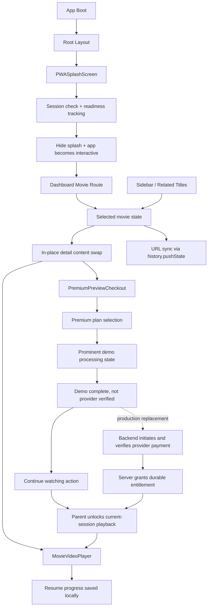

# SawaFlix movie flow, splash, and payment delivery summary

Branch name: `feat/movie-flow-payment-splash`

Work duration: 4 days

Submitted by: Fonyuy GIta

## Executive summary

This delivery focused on a stable in-page movie switching flow, a polished startup experience in both visual themes, and a premium checkout experience with a clearly labelled frontend payment simulation. The simulation demonstrates the interaction and lets the user continue playback, but it is not a provider transaction and must not be treated as a real charge or durable entitlement.

The main product issue was not in the video player itself but in route-level state management. The detail page behaved like a full route transition when the user selected a different movie, which caused excessive parent re-renders, unnecessary route churn, and a page-level refresh feeling even though the app was already on a dynamic movie route. The fix preserved the shell, updated only the active movie object, and synchronized the browser URL without forcing a full navigation lifecycle.

We also improved the app startup with a once-per-session splash that tracks progress, respects reduced motion, and gracefully falls back if loading stalls. On the payment experience, we structured the modal around access tiers and deferred the final success state until the backend is ready, keeping the frontend honest and production-safe.

## Root cause and technical fix

### 1) Why the movie detail page felt like a full reload

The movie details screen was effectively treating the selection of a different title as a redirect-style event instead of an in-place state swap. That meant the app would rebuild a larger segment of the dashboard tree, reset nested components, and trigger the same sort of visual churn you would expect from a route change.

The final fix was a local state model:

- the active movie is held in client state for the route
- the selected value changes without remounting the host layout
- the browser URL is updated with `history.pushState` so the route still reflects the current item
- the movie-detail shell stays mounted while the content is replaced in place

This keeps the app responsive and avoids reinitializing unrelated content like the sidebar shell, top-level navigation, and layout wrappers. In UI terms, the user sees a fast, seamless film switch rather than a full page refresh.

### 2) Why the splash loader behaves correctly

The startup screen tracks real lifecycle milestones instead of pretending to be a static loading animation. It waits for relevant app readiness signals, calculates progress with easing behavior, and stops at ~90% before the app is truly ready. Once the environment is stable, the loader fades out to reveal the application.

This avoids two common UX problems:

- a loader that reaches 100% before the app is actually ready
- a loader that never resolves when the network or fonts take longer than expected

The final loader includes a retry action and checks `prefers-reduced-motion` to avoid unnecessary motion for users who prefer calmer transitions.

### 3) Payment simulation, playback unlock, and backend boundary

The checkout modal exposes the access tiers and payment-method choices. After validation, the current frontend demo waits briefly and presents a clearly labelled “Demo payment complete” state. The user can then select “Continue watching,” which calls the movie page's existing unlock handler. That handler removes the preview limit for the selected title, closes checkout, resets the player resume token, and restarts playback.

This behavior is a client-side demonstration only: it does not contact MTN MoMo or Orange Money, verify a provider callback, charge an account, or persist access across sessions. The success copy explicitly states this boundary. Production access must be granted only after the backend verifies a provider transaction and returns an authoritative entitlement; the frontend callback is the integration point for that future response.

While the simulation is running, the modal displays a high-contrast status panel with a large spinner, descriptive live-region text, and a visible animated progress indicator. This makes the pending state understandable in either theme and gives assistive technology a status announcement.

The loader is rendered as a translucent, blurred overlay positioned inside the checkout dialog. It stays centered over the dialog without replacing the modal surface, so users retain visual context while the controls are temporarily blocked during processing.

### 4) Why playback remains visible after checkout resumes

The movie player has a separate readiness state from its playing/paused state. Previously, toggling playback or changing the resume token also cleared readiness. If the already-mounted YouTube iframe did not emit another ready event, the player could remain covered by its blurred poster layer even though playback had resumed. Readiness now resets only when the video ID changes; playback and resume state are synchronized independently. This keeps the active iframe visible when checkout returns control to the player.

### 5) Chat assistant Markdown runtime stability

The chat drawer is mounted from the root layout, so a failure while loading its Markdown parser can prevent the dashboard shell from mounting. The chatbot and full-page assistant now use the base `react-markdown` parser without the additional GFM plugin, and streamed values are normalized to strings before parsing. This narrows the parser pipeline and avoids passing non-string stream payloads into Markdown rendering. The UI keeps its custom rendering for headings, lists, links, and inline code.

## Rendering and state architecture improvements

### In-place data substitution vs. route remounting

The architectural intent was to keep a stable page shell and swap only the active movie payload. Separating the selected movie from the page container makes the flow more predictable:

- the route remains the same logical detail page
- selection changes are local client-state updates
- content re-renders are minimized to the active movie area
- related components remain mounted and can reuse state if needed

This is a classic rendering optimization: the app no longer destroys and rebuilds the entire route container for a content change that is conceptually a local entity change.

### Session-scoped splash state

The app loader is gated by browser session storage. A session is a good scope because it prevents repeated startup friction while still allowing fresh sessions to re-trigger the onboarding experience. The loader also tracks real readiness events like fonts, assets, or initial app boot rather than relying purely on a timer.

### Payment-tier and transaction-state separation

The checkout flow separates plan selection, input validation, processing, demo completion, and playback continuation. The current client-side contract is:

1. User chooses a plan and a supported payment method, then enters a mobile number.
2. The app validates the input and displays a prominent processing state.
3. The demo reaches a labelled completion state; it does not assert that a provider charged the user.
4. The user chooses “Continue watching”; the parent page unlocks playback for the current session and resumes the movie.
5. Later, backend integration must replace the timer with server initiation, provider confirmation, and server-authoritative entitlement before invoking the same playback continuation path.

Keeping provider verification outside the present UI prevents a client timer from becoming a payment security boundary. A browser-controlled completion flag can be modified by the user, so it must never grant persistent or billable access in production.

## File-by-file changes

### App shell and routing

- `app/layout.tsx`
  - Mounts the app shell and splash orchestration at the root level.
  - Keeps the loading state available globally without forcing page-level reloads.

- `app/(dashboard)/dashboard/movie/[id]/page.tsx`
  - Handles the active movie state and in-place swapping logic.
  - Keeps selection and URL state synchronized through a client-side route update pattern that avoids full route churn.

### Playback and premium flow

- `components/Movie/MovieVideoPlayer.tsx`
  - Coordinates resume behavior and preview gating with the selected movie.
  - Separates player readiness from playback state so resuming does not leave the loading poster covering the video.

- `components/Movie/PremiumPreviewCheckout.tsx`
  - Introduces plan selection with 250 XAF / 500 XAF / 1500 XAF pricing.
  - Shows a prominent accessible loader during the clearly labelled frontend payment simulation.
  - Renders that loader as a centered translucent overlay over the checkout modal.
  - Offers “Continue watching” after demo completion and calls the parent's existing unlock callback; the UI explicitly states that provider verification and persistent entitlement are not implemented.

- `components/Movie/movieProgress.ts`
  - Preserves watch progress and resume points across different titles.

### Chat assistant

- `components/ChatBot/SawaBot.tsx` and `app/(dashboard)/dashboard/sawai/page.tsx`
  - Remove the additional GFM plugin from the Markdown render path implicated by the root-layout runtime stack.
  - Normalize streamed response payloads before Markdown parsing to keep renderer input string-safe.

### Splash and startup

- `components/PWASplashScreen.tsx`
  - Adds session gating, progress tracking, retry handling, reduced-motion awareness, and fade-out behavior.

### Sidebar and selection flow

- `components/Dashboard/rightsidebar.jsx`
  - Triggers selected item transitions from the right-side recommendation area without forcing a whole-page transition.

- `components/Movie/MovieCard.tsx`
  - Keeps selection interactions aligned with the route-local state model.

## Rendering flow diagram

## Outcome

This release gives the app a cleaner interaction model: stable movie switching, a polished once-per-session loader, and a transparent premium flow. The demo flow now returns the viewer to playback after an explicit continue action, while clearly distinguishing simulated completion from verified payment. The team can replace the timer with the provider-backed lifecycle without changing the playback continuation contract.

## Notes

- The frontend payment simulation is not a real charge or verified payment; its unlock is temporary client state for demonstrating playback continuation.
- The movie switching fix is a rendering optimization and UX improvement, not a route replacement strategy.
- The splash and checkout flows are ready for future integration with production services once the backend is available.
